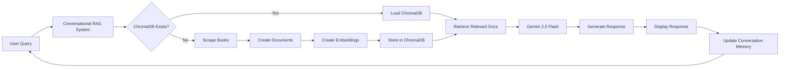

# Conversational Book Information Retrieval System

This repository implements a conversational Retrieval Augmented Generation (RAG) system using Gemini 2.0 Flash, Google Generative AI Embeddings, and ChromaDB to provide information about books scraped from [books.toscrape.com](https://books.toscrape.com/). It features persistent storage, conversational context awareness, and robust error handling.

## Key Capabilities

* **Conversational Context Awareness:** Maintains a chat history to understand the flow of the conversation.
* **Web Scraping:** Scrapes book data from books.toscrape.com, including title, price, description, category, and other details.
* **Persistent Vector Store:** Uses ChromaDB to create and persist a vector store of book information, allowing for efficient retrieval.
* **Gemini Integration:** Leverages Gemini 2.0 Flash for question answering and text generation.
* **Google Generative AI Embeddings:** Uses Google Generative AI Embeddings to create vector embeddings for book data.

## Architecture



## Prerequisites

* Python 3.6+
* Google Cloud Project with Gemini API enabled
* Google Cloud API key
* `.env` file with `GEMINI_API_KEY` set

## Installation Guide

1.  **Clone the repository:**

    ```bash
    git clone [repository_url]
    cd [repository_directory]
    ```

2.  **Create a virtual environment (recommended):**

    ```bash
    python3 -m venv venv
    source venv/bin/activate  # On macOS and Linux
    venv\Scripts\activate  # On Windows
    ```

3.  **Install dependencies:**

    ```bash
    pip install -r requirements.txt
    ```

    (See `requirements.txt` for the list of dependencies.)

4.  **Create a `.env` file:**

    ```
    GEMINI_API_KEY=YOUR_GEMINI_API_KEY
    ```

    Replace `YOUR_GEMINI_API_KEY` with your actual Gemini API key.

5.  **Place the following files in your directory:**

    * `bookquery.py` (Main script)
    * `webscraper.py` (Web scraping functions)
    * `rag_utils.py` (RAG system utilities)

## Usage

1.  **Run the script:**

    ```bash
    python bookquery.py
    ```

2.  **Enter your queries:**

    The script will prompt you to enter queries about books. You can ask questions like:

    * "Tell me about 'A Light in the Attic'."

3.  **Exit the application:**

    Type "exit" and press Enter.

## Code Explanation

* `bookquery.py`: Main script that orchestrates the RAG system and handles user interaction.
* `webscraper.py`: Contains functions for scraping book details (`extract_book_details`) and scraping all books (`scrape_all_books`).
* `rag_utils.py`: Holds the `build_rag_system` function that sets up the conversational RAG system, including ChromaDB, embeddings, Gemini integration, and conversation memory.


## Contributing

Contributions are welcome! Please submit a pull request or open an issue for any bugs or feature requests.


